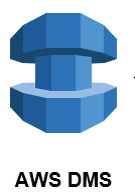

# Introduction to SCT / DMS Immersion Day Labs
This GitHub project provides a series of lab exercises which help users learn about Schema Conversion Tool (SCT) and Database Migration Services (DMS) on the AWS platform.  This lab uses an Amazon Relational Database Service (RDS) Oracle database as the source database and an Amazon Aurora PostgreSQL database as a target database.  The labs launches an EC2 instance to leverage SCT, Oracle SQL*Developer and pgAdmin.  It provides first-hand experience with AWS services like RDS, SCT, DMS, EC2, VPC and S3.  Please reach out to Marvin Vinson at mavinson@amazon.com for assistance or feedback. 

We highly recommend reviewing the Oracle to Aurora PostgreSQL Migration Guide.  It can be accessed at https://aws.amazon.com/dms/resources/

## Labs
|# |Lab Name |Lab Description |
|---- |---- | ----|
|0 |[Lab Setup Instructions](Lab_Instructions/0-EnvironmentConfiguration.pdf) |Instructions to setup the AWS services |
|1 |[Convert the Schema with SCT](Lab_Instructions/1-DMS-Lab-Oracle-SCT.pdf) |Convert the RDS Oracle objects to Aurora PostgreSQL |
|2 |[Migrate the Data with DMS](Lab_Instructions/2-DMS-Lab-Oracle.pdf) |Migrate the RDS Oracle data to Aurora PostgreSQL |

## License Summary

This sample code is made available under the MIT-0 license. See the LICENSE file.
